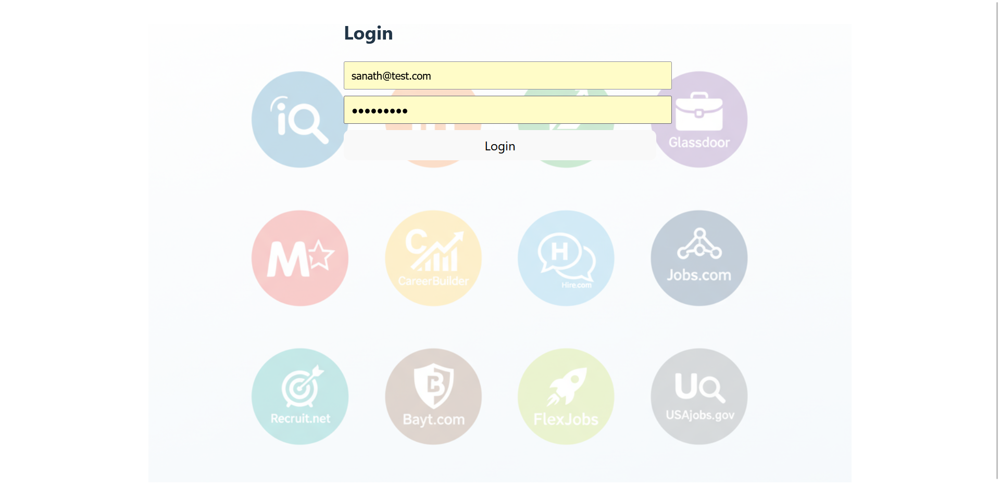
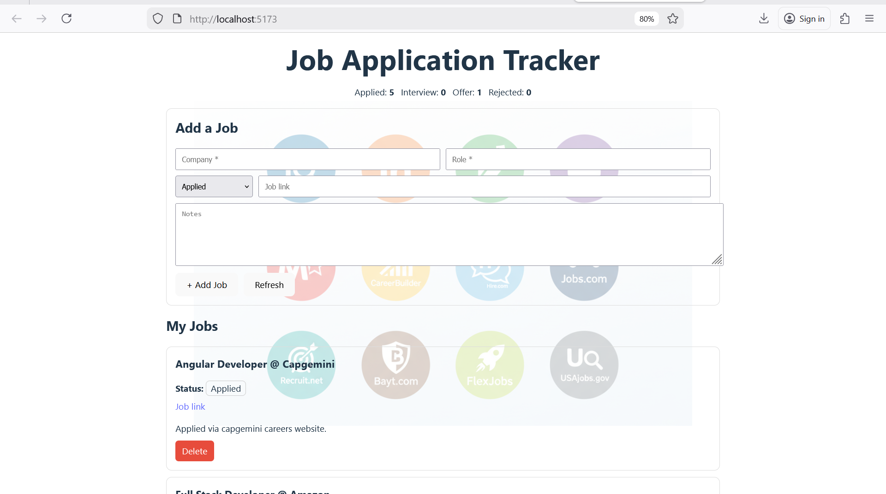

# Job Application Tracker

A full-stack Job Application Tracker that helps users manage job applications, track statuses, and visualize progress through a clean and intuitive dashboard UI.

##  Features

- Add and manage job applications
- Track application status (Applied, Interview, Offer, Rejected)
- Real-time job statistics dashboard
- Clean UI with subtle background watermark branding
- RESTful API backend
- Secure environment variable handling

## Tech Stack

**Frontend**
- React (Vite)
- JavaScript
- HTML5 & CSS3

**Backend**
- Node.js
- Express.js
- REST APIs

**Database**
- MongoDB Atlas

**Tools & Platform**
- Git & GitHub
- VS Code
- MongoDB Atlas Cloud
## Screenshots

### Dashboard View

### Add Job Form

